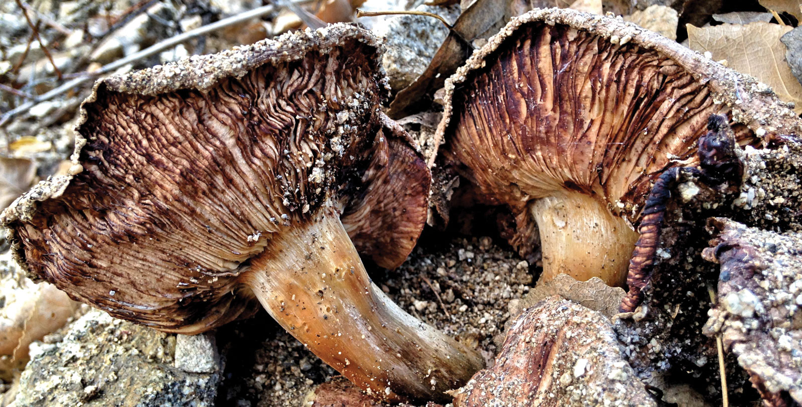
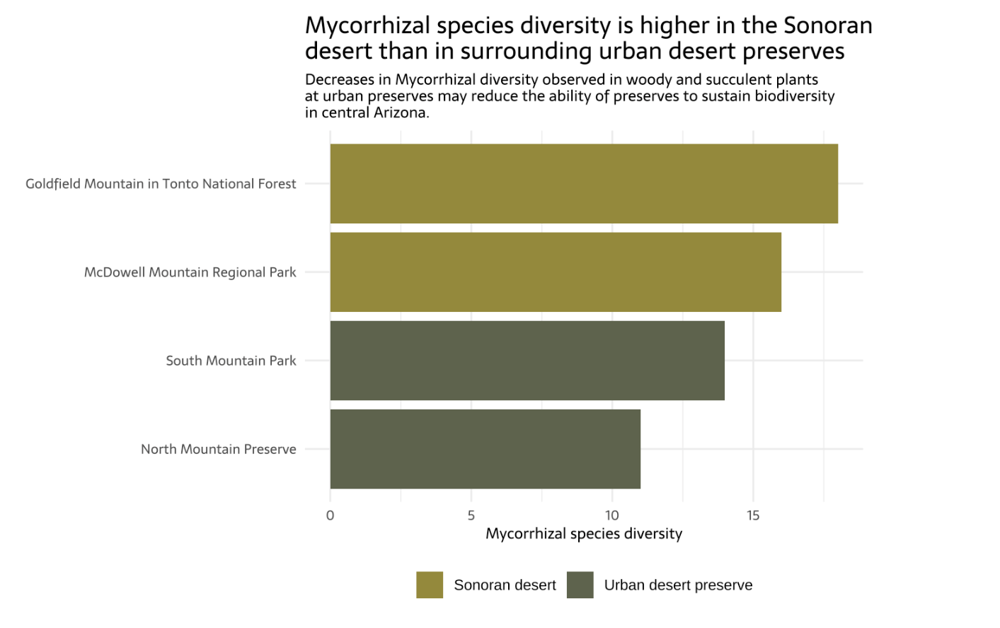

# Mycorrhizal database

Author: Ava Robillard

This repository contains code to create a database and explore mycorrhizal fungal diversity among plants in urban desert preserves and surrounding deserts in central Arizona.

Mycorrhizal fungi are soil fungi that form a symbiotic relationship with plant roots. They extend root systems via thread-like hyphae, drastically increasing water and nutrient uptake which is especially important in arid desert environments.

 

## Repository Structure

```         
mycorrhizal-database                  
.
├── clean_data                           # Cleaned data- output of data cleaning script
│  ├── colonization_clean.csv
│  ├── plants_clean.csv
│  ├── sites_clean.csv
│  └── species_occurrences_clean.csv
├── data                                 # Raw data- input of data cleaning script
│ └── knb-lter-cap.562.10
├── datacleaning.qmd                     # Data cleaning script
├── diversityqueries.sql                 # Query and table definitions
├── mycorrhizal-database.Rproj
├── mycorrhizal.db                       # database
├── README.md         
├── requirements.txt                     # R dependencies
└── visualization.qmd                    # Data analysis and visualization
```

This repository contains a workflow of:

1)  A cleaning script for raw data (`datacleaning.qmd`).
2)  Table definitions for ingesting the clean data into a database (`diversityqueries.sql`).
3)  A data analysis and visualization script to create a plot of mycorrhizal fungi species diversity by desert site (`visualization.qmd`).

Ensure that the specifications in `requirements.txt` are met. Run all SQL scripts from the project root (mycorrhizal-database/).

## Data access

The full data can be downloaded from [this link](https://doi.org/10.6073/pasta/b2615dd0ed796e899446e46b75c56643) and placed within a `data` folder at the project root as described by the repository structure diagram to optionally run the data cleaning script. The resulting cleaned data used for the analysis and visualization is located within `clean_data`.

The data is titled Arbuscular mycorrhizal fungal diversity and functioning in urban desert preserves and surrounding deserts in the central Arizona. It was created by Jean Stutz and Aura Ontiveros from Arizona State Univeristy in 2013 to better understand whether the creation of urban preserves reduce the impact of urbanization on biodiversity of native ecosystems.

## References

This assignment was created as a part of [EDS 213: Databases & Data Management](https://ucsb-library-research-data-services.github.io/bren-eds213/), taught by Julien Brun, Greg Janée, Annie Adams and Renata Curty.

Stutz, J. and A. Ontiveros. 2013. Arbuscular mycorrhizal fungal diversity and functioning in urban desert preserves and surrounding deserts in the central Arizona ver 10. Environmental Data Initiative. <https://doi.org/10.6073/pasta/b2615dd0ed796e899446e46b75c56643> (Accessed 2026-05-06).

README image: Mycorrhizal Mushrooms. Photo 2018 © Robin Kobaly
