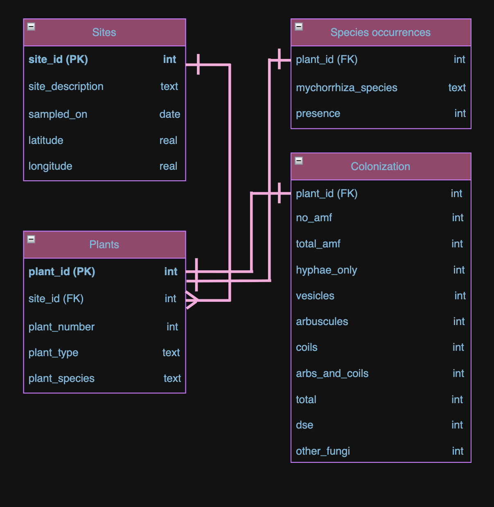

### Read in data
```{r}
#| message: FALSE
library(tidyverse)
library(here)

# Read in data
# Sampling site descriptions
sites <- read_csv(here("data", "knb-lter-cap.562.10", "300_sites_1.csv"))

# Absence or presence of mycorrhiza species
species_occurrences <- read_csv(here("data", "knb-lter-cap.562.10", "300_species_occurrance_1.csv"))

# Colonization of plant roots
colonization <- read_csv(here("data", "knb-lter-cap.562.10", "300_summary_data_1.csv"))
```

### Database schema 

The schema for this database that the following code creates is shown below.



### Sites table

```{r}
# View data types
glimpse(sites)
```
We only need one primary key column in this data frame to connect to my other dataframes, site_id. Therefore, we can drop the generated ID column. 

It looks like all of the data types are as expected (character for site_id and site_description, datetime for sampled_on, and double for lat and long). 

```{r}
# Remove ID column
sites_clean <- sites %>% 
  select(-ID)
```

### Species_occurrences table 

Next, we have species occurrences, which is the absence or presence of mycorrhiza species. This data frame has a lot of information, including a plant_id and a lot of information about each plant before it includes the absence or presence of these species. Based on this, we want to normalize the data further and create an intermediary table for just plants. 

This table will include a unique ID as the primary key (the existing plant_id is not unique, it repeats 1-10 for each site and plant type- for each site there are 10 succulent plants and 10 woody plants) to associate that plant with the other tables rows. 

```{r}
glimpse(species_occurrences)
```

```{r}
species_occurrences <- species_occurrences %>% 
  # Add unique primary key 
   mutate(id = row_number()) %>% 
   relocate(id) %>% 
  # Rename plant_id and id column 
  rename(plant_number = plant_id) %>% 
  rename(plant_id = id)
```

### Plants table 

```{r}
# Select rows for intermediate table
plants_clean <- species_occurrences %>% 
  select(c(plant_id, site_id, plant_number, plant_type, plant_species)) 
```

Now that the intermediary plant table has been created, we can check the types.

```{r}
glimpse(plants_clean)
```
All of the types are as expected. 

Next, we can edit the species_occurrences table and replace the plant info with just the plant_id. 

```{r}
# Replace plant info with plant_id
species_occurrences <- species_occurrences %>% 
  select(-c(ID, site_id, plant_number, plant_type, plant_species))
```

Now, we want to pivot the presence/absence columns from wide to long format, with a mychorrhiza_species column and a presence column (0/1).

```{r}
# Pivot longer
species_occurrences_clean <- species_occurrences %>% 
  pivot_longer(
    cols = acaulospora_delicata:acaulospora_mellea,
         names_to = "mycorrhiza_species",
         values_to = "present")
```

```{r}
glimpse(species_occurrences_clean)
```
The types look good!

### Colonization table 

Let's look at colonization 
```{r}
glimpse(colonization) 
```
We can similarly replace the plant info columns with a plant id, and we don't really need the id. 

```{r}
colonization <- colonization %>%
  # Rename same columns to match for joining 
  rename(plant_number = plant_id) %>%
  # Left join to match correct plant_id to row
  left_join(plants_clean, by = c("site_id", "plant_number", "plant_type", "plant_species")) %>%
  # Remove redundant columns
  select(-c(ID, site_id, plant_number, plant_type, plant_species)) %>% 
  # Move plant_id to the front 
  relocate(plant_id)
```

```{r}
glimpse(colonization)
```
The types for each column in our cleaned colonization df match the metadata!
There are a few rows with all NA's at the bottom of this data set, so we can remove them. 

```{r}
# Remove rows with all NAs
colonization_clean <- colonization %>%
  filter(!is.na(plant_id)) %>% 
  # Remove row where all other columns are NA
  filter(!if_all(-plant_id, is.na)) 
```

### Ingestion into DuckDB

Now that the data is cleaned, the types of each column are checked, and normalized, we can write them to new csv files for ingestion into DuckDB. 

```{r}
# File names
datadir_clean <- file.path("clean_data")

# Check if the folder exists
dir.create(datadir_clean, showWarnings = FALSE)

# Write the files
write_csv(sites_clean, file.path(datadir_clean, "sites_clean.csv"))

write_csv(plants_clean, file.path(datadir_clean, "plants_clean.csv"))

write_csv(species_occurrences_clean, file.path(datadir_clean, "species_occurrences_clean.csv"))

write_csv(colonization_clean, file.path(datadir_clean, "colonization_clean.csv"), na = "")
```
